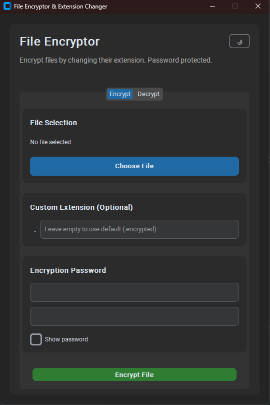
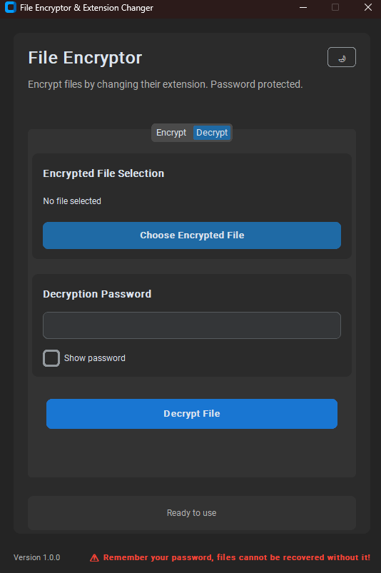

# File Encryptor & Extension Changer

## Introduction
File Encryptor & Extension Changer is a simple and secure Python application that allows users to encrypt and decrypt files with password protection. Additionally, it provides an option to change file extensions, adding an extra layer of security to your sensitive data.

## Features
- **File Encryption & Decryption** using a secure password-based system.
- **Custom File Extension Change** to obscure file types.
- **User-Friendly GUI** built with Tkinter & CustomTkinter.
- **Dark & Light Mode Support** for better usability.
- **Secure Encryption** using the Cryptography library.

## Installation
1. **Clone the repository:**
   ```sh
   git clone https://github.com/AhmedSamyMousa/File-Encryptor.git 
   ```

2. **Install dependencies:**
   ```sh
   pip install -r requirements.txt
   ```

3. **Run the application:**
   ```sh
   python main.py
   ```

## Usage
1. Open the application.
2. Select the file you want to encrypt.
3. Enter a secure password.
4. Choose a custom file extension (optional).
5. Click the "Encrypt" button.
6. To decrypt, select the encrypted file, enter the password, and click "Decrypt."

## Screenshots
### **Encryption Process**


### **Decryption Process**


## License
This project is licensed under the MIT License.

## Contributing
Feel free to submit issues or pull requests to improve the project!

## Contact
For any inquiries, contact **marcheder200.200@gmail.com** or open an issue on GitHub.

